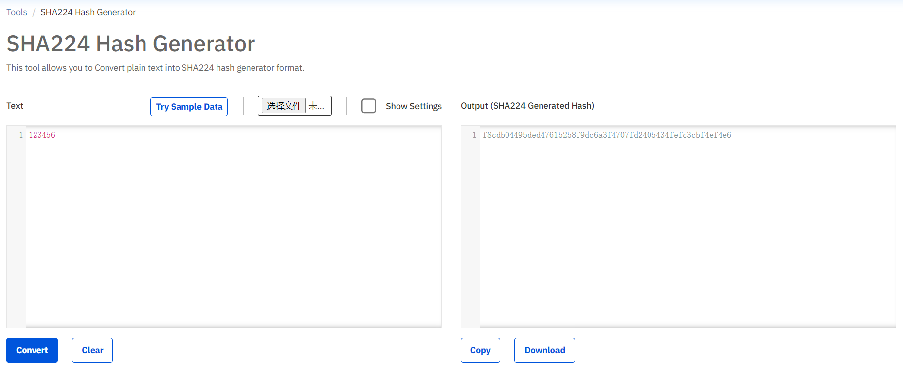

# Epeius
English | [简体中文](./README-zh_CN.md)

Deploy Trojan using a Serverless approach

## Quick start
- Create a new Worker in Cloudflare Workers dashboard.
- If your plain password is "123456", you can generate hash password "f8cdb04495ded47615258f9dc6a3f4707fd2405434fefc3cbf4ef4e6" [here](https://www.atatus.com/tools/sha224-to-hash).
- Create env PASSWORD in your cf workers. set above "f8cdb04495ded47615258f9dc6a3f4707fd2405434fefc3cbf4ef4e6" to PASSWORD in env. 
- Paste code from [worker.js](./src/worker.js) into the worker code editor. 
- Binding a custom domain to the worker.
- Visit `https://[YOUR_DOMAIN]/link` and replace `ca110us` with your plain password like above 123456.


## Config (example for clash)
Add this node in config file for clash
```yaml
- name: cf-trojan
  type: trojan
  server: trojan.cf.xxx.xxx
  port: 443
  password: xxxxxxxx
  udp: false
  tls: true
  network: ws
```

## Not supported
- UDP 🙅 (Cloudflare workers runtime does not support UDP yet), set the udp=false in your config file.

## Disclaimer
This project is for study/research purposes only. Users are responsible for legal compliance and ethical conduct. The author disclaims all liability for misuse.

## Reference
[zizifn/edgetunnel](https://github.com/zizifn/edgetunnel)
